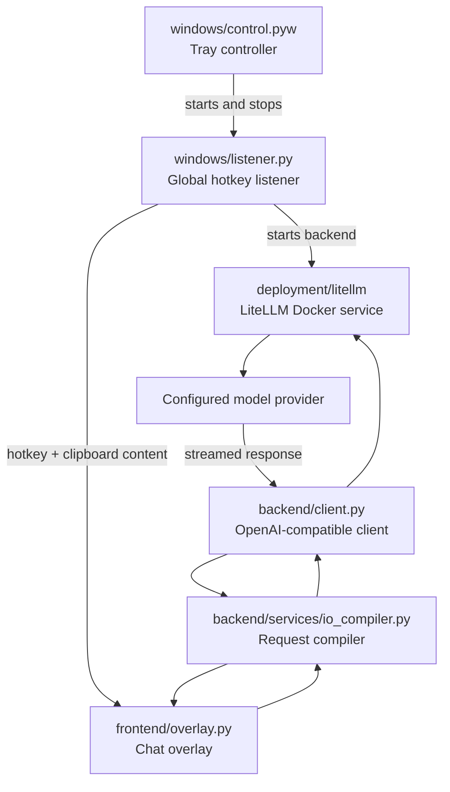

# Circle to Search for Windows

A Windows desktop utility that opens an AI chat overlay from a global hotkey. It sends clipboard text and images to a local LiteLLM proxy through an OpenAI-compatible endpoint.

## Requirements

- Windows
- Python 3.10+
- Docker Desktop
- An API key for the configured model provider

## Setup

1. Create and activate a virtual environment:

  ```powershell
  python -m venv venv
  .\venv\Scripts\Activate.ps1
  ```

2. Install dependencies:

  ```powershell
  pip install -r windows_requirements.txt
  ```

3. Create `.env` from `.env.example` and set `LITELLM_MASTER_KEY`, `LITELLM_BASE_URL`, and the provider key referenced by `deployment/litellm/litellm_config.yaml`.

4. Review the model and provider in `deployment/litellm/litellm_config.yaml`.

## Run

Start the tray controller:

```powershell
python windows\control.pyw
```

It starts the listener and LiteLLM backend. Use the tray icon to start or stop the listener.

Default hotkey: `Ctrl + Shift + F9`

The overlay offers available clipboard text or images when it opens. Images require a vision-capable model.

To launch at sign-in, create a shortcut to `windows\control.pyw` in the Windows Startup folder.

## Configure Models

Add the provider key to `.env`, then add or update a `model_list` entry in `deployment/litellm/litellm_config.yaml`. The model name used by the client is defined by `ACTIVE_MODEL` in `backend/client.py`.

Restart LiteLLM after configuration changes:

```powershell
docker compose -f deployment\litellm\docker-compose.yml down
docker compose -f deployment\litellm\docker-compose.yml up -d
```

## Logs

Runtime errors and request activity are written to `log.txt`.

## Control Flow

